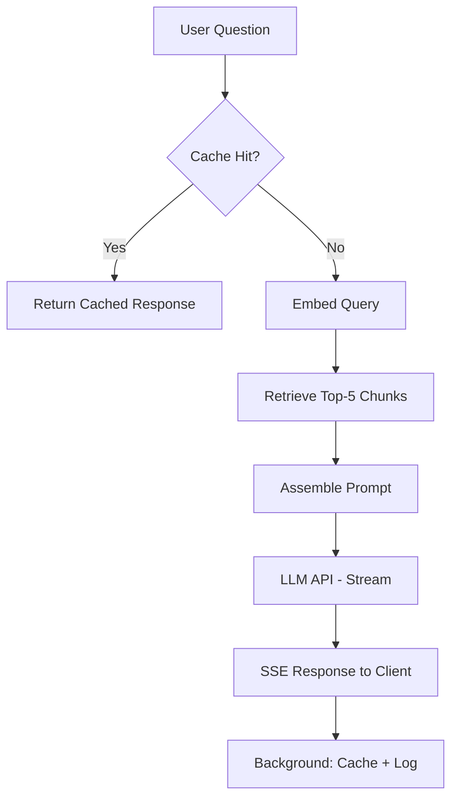

# Architecture Design

Before writing a single line of implementation code, spend 20 minutes on a design document. This is not bureaucracy — it forces you to catch integration problems before they become debugging problems at demo time.

## Learning objectives

- Document a system architecture with enough detail to guide implementation
- Identify the data flow, decision points, and failure modes before coding
- Choose the right components for the specific problem, not the most impressive-sounding ones

---

## Design document template

Copy this into a `DESIGN.md` at the root of your project.

```markdown
## Project: [Name]

### Problem statement
One sentence: what does this system do, and for whom?

### Data flow
1. User input → [what form?]
2. [First processing step] → [what output?]
3. [Continue until LLM response is returned]
4. Response → user

### Components
| Component | Technology | Why this choice |
|-----------|------------|-----------------|
| LLM API   | gpt-4o-mini | Cost-effective for this task |
| Vector DB | ChromaDB   | Local, no external service needed |
| API layer | FastAPI    | Async, streaming support |
| ...       | ...        | ... |

### Failure modes
- What happens if the LLM API is down? → [fallback]
- What happens if retrieval returns nothing? → [fallback]
- What happens if the response is malformed? → [retry/error]

### Evaluation
- Metric 1: [name] — [how measured] — [target value]
- Metric 2: [name] — [how measured] — [target value]

### Out of scope
- [Things explicitly not built, to prevent scope creep]
```

---

## Architecture patterns by option

### Option A — RAG service architecture

```
User HTTP request
    ↓
FastAPI /chat endpoint (async)
    ↓
Cache check (exact-match, SHA256 key)
    ├── HIT → return cached response (< 5ms)
    └── MISS ↓
Embedding API (text-embedding-3-small)
    ↓
ChromaDB retrieval (top-5 chunks by cosine similarity)
    ↓
Prompt assembly (system + retrieved context + user question)
    ↓
OpenAI chat completion (gpt-4o-mini, stream=True)
    ↓
SSE token stream → HTTP response
    ↓
Background task: log to audit trail, update cache
```

Key decisions:
- Exact-match cache before embedding (embedding costs $0.02/M tokens — not free)
- Retrieve 5 chunks, not 10 — more chunks dilute the context and increase tokens
- Stream the response — latency for long answers is perceptible

---

### Option B — LangGraph agent architecture

```
User question
    ↓
Planner node (gpt-4o, structured output)
    → Research plan: list of sub-questions
    ↓
Researcher node (parallel, asyncio.gather)
    → Tool calls: web search or document retrieval
    → Sources: list of (url, snippet) pairs
    ↓
Writer node
    → Draft report with citations
    ↓
Critic node (gpt-4o-mini)
    → quality_score: float (0–1)
    → feedback: str
    ↓
Conditional router
    ├── quality_score >= 0.8 → END
    └── quality_score < 0.8 and attempts < 3 → Writer node (loop)
```

State structure:
```python
class ResearchState(TypedDict):
    question: str
    plan: list[str]
    sources: Annotated[list[dict], operator.add]
    draft: str
    quality_score: float
    feedback: str
    attempts: int
```

---

### Option C — Document intelligence architecture

```
PDF upload (multipart/form-data)
    ↓
FastAPI /extract endpoint
    ↓
Text extraction (PyMuPDF page-by-page)
    ↓
Chunking (if doc > 8k tokens, chunk + summarize first)
    ↓
OpenAI function calling
    → Tool: extract_fields(schema)
    → Returns: validated Pydantic model
    ↓
Validation layer
    → Check required fields present
    → Confidence scoring (field completeness, value plausibility)
    ↓
Return JSON with confidence scores
```

---

## Component selection guide

| Decision | RAG service | Agent | Doc intelligence |
|----------|-------------|-------|-----------------|
| LLM | gpt-4o-mini | gpt-4o (planning) + mini (worker) | gpt-4o-mini |
| Vector DB | ChromaDB | ChromaDB or skip | Skip |
| Framework | FastAPI | LangGraph + FastAPI | FastAPI |
| Caching | Exact-match | Per-session state | Skip |
| Streaming | Yes | Optional (stream final report) | No |
| Eval | RAGAS faithfulness | Draft quality score | F1 vs ground truth |

> [!warning] Don't choose a component because it sounds impressive
> LangGraph is the right choice for stateful multi-step agents. It adds complexity for a simple one-shot RAG pipeline — use a plain async function instead. Match complexity to need.

---

## Mermaid diagram (paste into your README)



---

[[01-project-brief]] | [[03-implementation]]
